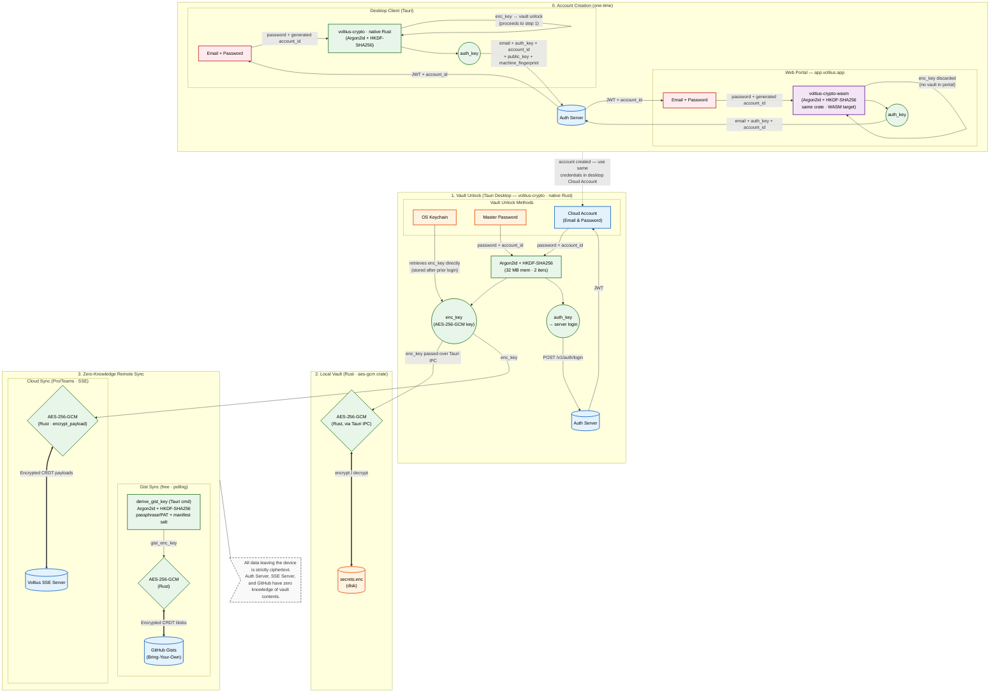

<div align="center">
  
  
  <br/>

  

  <h1>Voltius</h1>

  <p><strong>A modern SSH client built with Tauri, React, and Rust.</strong></p>

  <p>
    
    
    
    
    
  </p>
</div>

---

## ✨ Features

No account required. Everything below is free, forever.

- **Gist Sync** — E2EE device sync via your own private GitHub Gist. No central server, bring your own token.
- **SFTP** — Host↔Host and Host↔Local with drag & drop support.
- **Docker Integration** — Manage containers and open terminals directly in Voltius.
- **Split Panes** — Horizontal/vertical splits with broadcast input to multiple panes.
- **Plugin System** — Extend Voltius with MIT-licensed plugins.
- **Process Manager** — View and kill processes on connected hosts.
- **System Monitoring** — Live CPU, memory, and disk stats from connected hosts.
- **Local Terminal** — Bash, Zsh, Fish, PowerShell, WSL, Git Bash, CMD, and more.

> Full feature list at [docs.voltius.app](https://docs.voltius.app) *(coming soon)* · **Pro · Teams · Business** — see [voltius.app/#pricing](https://voltius.app/#pricing) for paid plans.

> Early beta — PRs and issues are welcome.

## ⚖️ Comparison

| Feature | Voltius | Termius | [Reach](https://github.com/alexandrosnt/Reach) | [Termix](https://github.com/Termix-SSH/Termix) | Tabby | PuTTY |
| --- | --- | --- | --- | --- | --- | --- |
| **Engine** | **Rust + Tauri** 🦀 | Electron | **Rust + Tauri** 🦀 |  | Electron / Node.js | C |
| **RAM Usage** | ~300MB | ~500MB+ | ~300MB | NOT TESTED | NOT TESTED | **~5MB** |
| **Installed Size** | ~60MB | ~1GB | ~60MB | NOT TESTED | NOT TESTED | **~3MB** |
| **Cloud Sync** | Gist (Free) / Real-Time (Paid) | 🟡 Only Pro | 🟡 Complex setup | ❌ | Community Plugins | ❌ |
| **Import/Export** | ✅ | 🟡 Strong Import Integrations but no Export | ✅ |  |  |  |
| **Port Forwarding** | ✅ | ✅ | ✅ |  | ✅ | ✅ |
| **Snippets** | ✅ + multi-exec | 🟡 Only Pro | ✅ + multi-exec |  |  |  |
| **Command Palette** | ✅ | ✅ |  |  | ✅ |  |
| **Split panes** | ✅ | | ❌ |  |  |  |
| **X11 Forwarding** | ❌ | | ❌ |  |  |  |
| **Docker Integration** | ✅ |  |  |  |  |  |
| **System Monitoring** | ✅ |  |  |  |  |  |
| **Jump Hosts** | ✅ | ✅ | ✅ |  |  |  |
| **Team vaults** | ✅ Teams or self-hosted | ✅ Teams plan | ✅ Free but complex |  |  |  |
| **Audit logs** | ✅ | 🟡 Teams plan |  |  |  |  |
| **Custom Themes** | ✅ |  |  |  | ✅ |  |
| **Folders &amp; Tags** | ✅ | ✅ | ✅ |  |  |  |
| **Auto-Updates** | ✅ | ✅ | ✅ |  |  |  |
| **Modern UI/UX** | ✅ | ✅ | 🟡 | ✅ | 🟡 | ❌ |
| **AI assistant** | ❌ | ✅ | ✅ |  |  |  |
| **Permissions** | ✅ Teams RBAC / Business custom roles | ✅ Granular perms |  |  |  |  |
| **Terminal sharing** | ✅ Pro (1 guest) / Teams (unlimited) | ✅ needs Teams plan |  |  |  |  |
| **Security** | **End-to-End Encrypted** | Proprietary E2EE | **End-to-End Encrypted** |  | Local Only / Manual |  |
| **SFTP host&lt;-&gt;host** | ✅ | ✅ | ❌ |  | ❌ | ❌ |
| **Serial Console** | ✅ | ✅ | ✅ |  | ✅ | ✅ |
| **Local-first** | ✅ 100% (No account needed) | ❌ (Requires account) | ✅ | ✅ | ✅ | ✅ |
| **Plugins** | ✅ | ❌ | ✅ | ❌ | ✅ | ❌ |
| **Platforms** | Windows, Linux, MacOS (Mobile coming soon) | Windows, Linux, MacOS, Android, IOS | Windows, Linux, MacOS, Android | All (web-based) | Windows, Linux, MacOS, Web | Windows, ReactOS, macOS, Linux |
| **Pricing** | Free / Pro $7 / Teams $15 / Business $30 | Very limited free tier (no sync) | Free | Free | Free | Free |
| **License** | **AGPLv3 (Core)** | Commercial / Paid | MIT | Apache License Version 2.0 | MIT | MIT |
| **OS Detection** | ✅ | ✅ | ✅ | ❌ | ❌ | ❌ |

## 🛡️ Architecture & Security
Voltius is built on a **Local-First, Zero-Knowledge** architecture. Your sensitive data (private keys, passwords, and server metadata) is encrypted on your machine before it ever touches a disk or a network.

### Account & Encryption Tiers
We offer three levels of security to fit your workflow:

- **OS Keychain (Local-Only)**: Uses your system's native secure storage (macOS Keychain, Windows Credential Manager, or Secret Service via keytar/libsecret). No master password required; maximum convenience for local-only use.

- **Master Password:** Encrypts your vault using a user-defined passphrase. Uses Argon2id for key derivation and AES-256-GCM for data encryption.

- **Cloud Account:** Enables seamless E2EE synchronization across devices via our high-speed relay service.

### Web Portal

Account registration and login at [app.voltius.app](https://app.voltius.app) are also fully E2EE. The same `voltius-crypto` crate is compiled to WebAssembly and runs entirely in your browser — key derivation (Argon2id + HKDF-SHA256) happens client-side before anything touches the network. The server only ever receives an `auth_key`, never your password or encryption key.

### Zero-Knowledge Synchronization
Whether you use our professional Cloud Sync or our built-in Gist Plugin, we follow a **Zero-Knowledge** protocol. All data leaving the device is strictly ciphertext — the auth server, SSE server, and GitHub have zero knowledge of vault contents.

<details>
<summary>Sync architecture diagram</summary>



</details>

## Prerequisites

- [Node.js](https://nodejs.org/) 24+
- [pnpm](https://pnpm.io/) — `npm i -g pnpm`
- [Rust](https://rustup.rs/) (stable toolchain)
- Tauri prerequisites for your platform — see [tauri.app/start/prerequisites](https://tauri.app/start/prerequisites/)

## 🛠️ Development & Build

For dev, you simply need to run:
```bash
pnpm i
pnpm tauri dev
```

### Building in Docker (recommended)

I've made a Dockerfile that allows cross-compilation to Windows ARM64/x64; Linux ARM64/x64 without needing to set up a complex toolchain on your machine:

```bash
# Build the cross-compilation image
docker build -f Dockerfile.cross-compile -t voltius-cross .

# Run the build inside the container
docker run --rm -it \
  -v "$(pwd):/project" \
  voltius-cross \
  bash -c 'pnpm tauri build --target aarch64-pc-windows-msvc --runner cargo-xwin --no-bundle'
```

The `--no-bundle` flag skips NSIS installer creation (not supported in cross-compilation). The built executable is at:
```
src-tauri/target/aarch64-pc-windows-msvc/release/voltius.exe
```

You can replace `aarch64-pc-windows-msvc` with the appropriate target. Here's a quick reference for targets:
- Windows x64: `x86_64-pc-windows-msvc`
- Windows ARM64: `aarch64-pc-windows-msvc`
- Linux x64: `x86_64-unknown-linux-gnu`
- Linux ARM64: `aarch64-unknown-linux-gnu`

If you want to build for other target, see `rustup target list` and add with `rustup target add <target>`. I have not tested other targets.

> Note: build will work but throw an error except if you set TAURI_SIGNING_PRIVATE_KEY and TAURI_SIGNING_KEY_PASSWORD to dummy values, which is required by the Tauri build process even if you don't do code signing in cross-compilation. You can set them to any non-empty value to bypass the error.

### 🐧WSL2 dev note

```sh
sudo apt install -y build-essential libssl-dev pkg-config libgtk-3-dev libwebkit2gtk-4.1-dev
LIBGL_ALWAYS_SOFTWARE=1 && pnpm tauri dev
```

### Build

```bash
pnpm tauri build
```

Output installers are placed in `src-tauri/target/release/bundle/`.

## 🧰 Tech Stack

| Layer       | Tech                               |
|-------------|------------------------------------|
| Frontend    | React 19, TypeScript, Tailwind CSS |
| Desktop     | Rust, Tauri 2                      |
| Sync Server | Rust, Axum, PostgreSQL             |
| Terminal    | xterm.js (WebGL Accelerated)       |
| SSH/SFTP    | russh                              |
| Security    | Argon2id, AES-256-GCM (E2EE)       |

## 📄 Licensing
Voltius is licensed under the AGPLv3 for the core application and MIT for plugins. This means you can use and modify the core app for free, but if you distribute a modified version, you must also share your changes under the same license. Plugins can be used and shared with more flexibility under the MIT license.
Copyright © 2026 Killian Pavy. All rights reserved.
